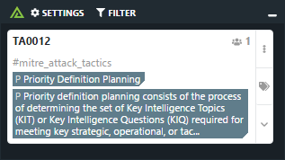
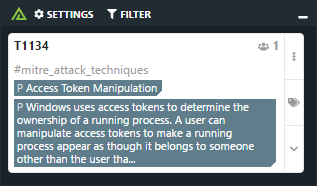
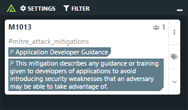
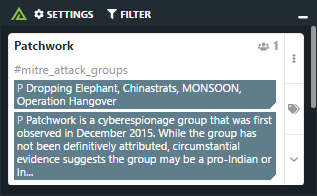
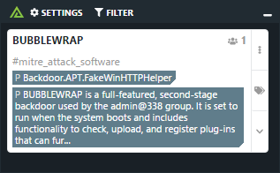
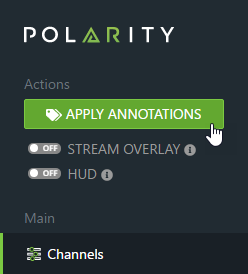
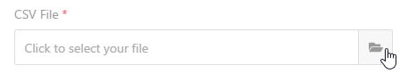
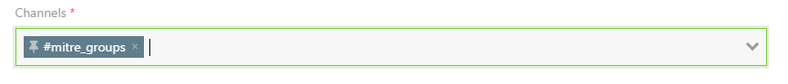

# Polarity Reference Channel Data

Polarity Reference channels are a set of curated data that can be imported into a channel for use by your team.

## Available Reference Channel Data

### Mitre Att&ck Tactics

`mitre-channels/mitre_att&ck_tactics_v1.0.0.csv`

Contains information about Mitre Att&ck Tactic Ids including Pre-Att&ck, Enterprise and Mobile.  Tactics Ids are of the form `TA####`.

More Info: https://attack.mitre.org/tactics/pre/

### Mitre Att&ck Techniques

`mitre-channels/mitre_att&ck_techniques_v1.0.0.csv`

Includes reference information about Mitre Att&ck Techniques including Pre-Att&ck, Enterprise and Mobile.  The channel data provides contextual information around the Technique Ids which are of the form `T####`.

More Info: https://attack.mitre.org/techniques/pre/

### Mitre Att&ck Mitigations

`mitre-channels/mitre_att&ck_mitigations_v1.0.0.csv`

Contains information about Mitre Att&ck Mitigation codes including Enterprise and Mobile.  The channel data provides contextual information around the Mitigation Ids which are of the form `M####`.

More Info: https://attack.mitre.org/mitigations/enterprise/

### Mitre Att&ck Groups

`mitre-channels/mitre_att&ck_groups_v1.0.0.csv`

The Mitre Att&ck Group reference channel contains information about sets of related intrusion activity and the common names used in the security community to reference the activity.

More Info: https://attack.mitre.org/groups/

### Mitre Att&ck Software

`mitre-channels/mitre_att&ck_software_v1.0.0.csv`

Contains information about Mitre Att&ck Software.

More Info: https://attack.mitre.org/software/

*© 2018 The MITRE Corporation. This work is reproduced and distributed with the permission of The MITRE Corporation.*

## Installing Reference Channels

Reference channels are installed by uploading them into a channel in your Polarity instance.  

1. Click on the **Apply Annotations** button in the main window of Polarity.

2. Click on the **CSV** tab in the Apply Annotations modal that opens.

3. Click on the **open file** button and select the CSV you want to import

Once loaded a preview of the data will appear in the **Apply Annotations** window.

4. All reference channel files contain a header row so ensure all the option boxes are checked as follows:

5. At the bottom of the **Apply Annotations** modal select the **Channel** you would like to import the data into:

> If the channel you want to import the data into doesn't exist, you can create a new channel right from the channel selector

6. Press the **Apply Annotations** button to start the import process.

7. Once complete, you can now subscribe to the channel to receive notifications

## About Polarity

Polarity is a memory-augmentation platform that improves and accelerates analyst decision making.  For more information about the Polarity platform please see:

https://polarity.io/
